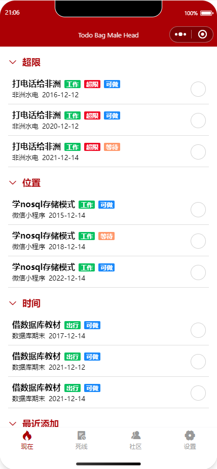
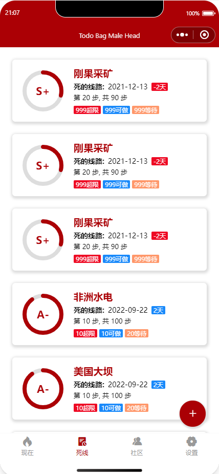
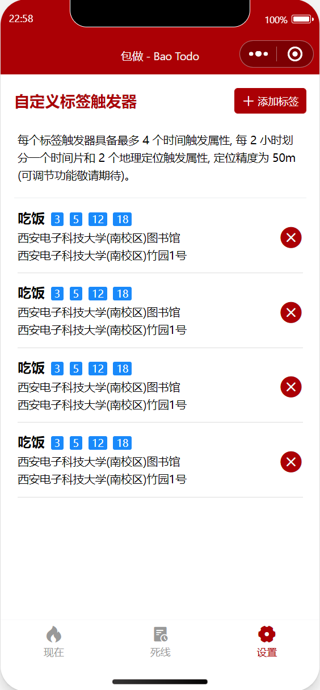
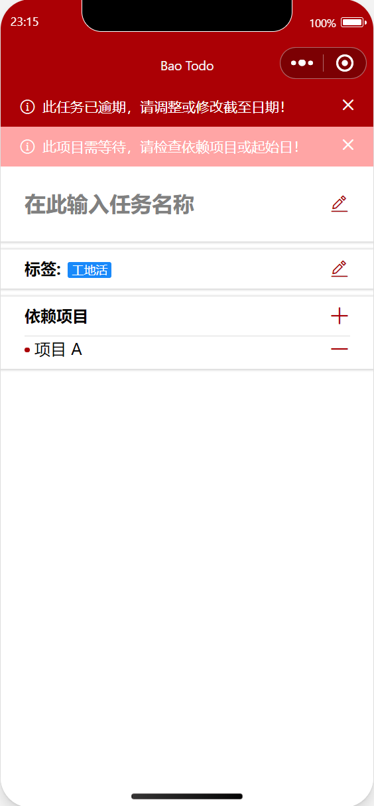
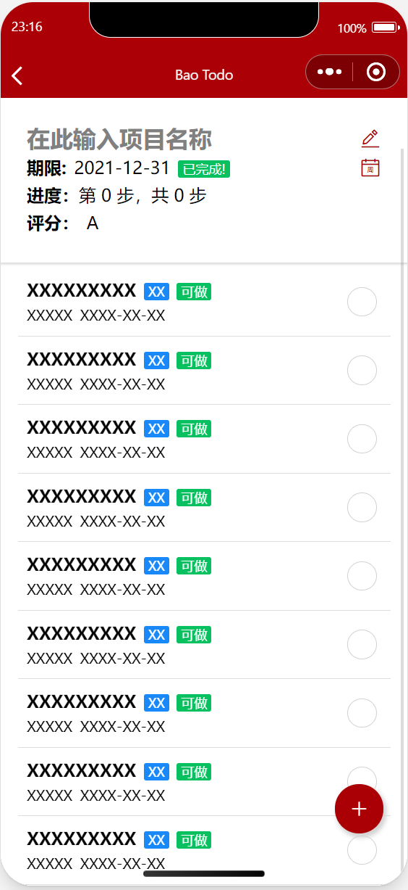

# 包工头 Todolist 小程序

当今社会，每个人都有很多任务要处理。根据 GTD 理论，能马上完成的事情必须尽早完成，能马上开始的事情必须尽早开始，能**外包**的事情绝不自己做，一下子做不完的事情 DDL 没到之前**能不做就不做**。互联网发展进入第三阶段后，物理世界逐渐实现全面数字化。这意味着生产力和生产关系发生了变化，个人需求和形式也必须随之改变，才能够更好地应对挑战。传统的 GTD 只是针对个人业务管理，每个人的 GTD 系统不一样，很难**形成闭环**，打通**全链路聚合**，这次我的小程序通过提供**统一生态**，**精细化沟通**，减少分歧。通过包工头 Todolist 小程序，提供一个包工头和力工的统一沟通协作平台，**重构**协同办公，使得计划到位，目标清晰，通过暴露互联网外包的**抓手**，**精准施策**，**耦合** GTD 理论，打通 GTD **全链路生态**，**赋能**大家的日常生活，让外包力工和外包包工头之间最终**形成完美的闭环**，**对齐**双方，**凝聚**共识，解决 GTD 在外包工程应用过程中的**痛点**。

本小程序**执行部分**根据 GTD 理论，只抽象出**死线**和**条目**两个概念，通过用户提前注入**场景**，如时间点触发，地理位置触发，生活场景触发。

将**条目**根据场景分为各种不同类型的执行**促进生活场景全链路打通**，利用小程序 API 获取地理时间信息**形成抓手**，~~提供社区小组团购功能~~使用户生活**形成闭环**。

~~随着不断更新, 未来将打造成中国数一数二的包工头**元宇宙**! (~~

### 点中点：
- 简洁聚焦 UI，好看也好用，操作逻辑简化，**傻瓜**式操作，用户**没有学习成本**。
- 基于**标签触发器**的场景任务列表实时更新上下文，解决人工检索 trigger list 的痛点。
- APP 功能扩展性强，采用简化 GTD 概念，程序设计简单可扩展，未来可扩展支持**元宇宙**，打通全链路虚拟体验。
- 采用云开发文档数据库部署，轻便简单，**方便导出数据**（json 可读易解析）逃离本平台快速迁移到其他平台。
- 组件采用 Vant-weapp UI 开源组件，与自定义组件，可复用组件定制 component **前端模块化**， 支持魔改其他用途，轻便快速。
- CRUD 尽可能在云函数上一次完成，一次数据传送，用户修改更新数据时基于 MVVM 定制**三级反馈数据缓存模式**，减少延迟，提升用户体验。

### 目录：

- 小程序界面（初版）

- 库表设计

- 存储设计（三级反馈数据缓存模式）

- 概念设计

- 可能的功能

- 开发日志

---

# 小程序界面（初版）：

---
# 库表设计（已大改）

但是懒得画 E-R 图了，指哪打哪，敏捷开发，快速出活。

### User Information(扩展用，以及社区信息)：
 - _id: generated by wx db
 - _openid(primary key): identify a user (basically for searching his project list)
 - _description: user name etc. preserved for future use
 - _register_date: maybe useful
 - _share_id: (not implemented yet), an inter-application user id (一个做法是通过 id 加好友，第二个是社区大厅里面用的，目前想法是加载用户列表？然后根据这个 id去调用云函数)
 - _reputation: preserved （可以用来排名）

### Todos (登录的时候 load 进来): 
 - _id: wx genreate
 - _openid(primary key): identify a user (basically for searching his project list)
 - _projects(an array), 后面可能会改用外键（即当成关系型数据库用，同时这样能够提供外包项目共享和权限控制功能），但是这样要直接合并 Todos 和 User Information 两个表。

 ### project 对象设计(包括视图和持久化)
 标记为 agg 的为聚合属性,需要根据 sub 列表内容计算更新. 
 - pid: 项目 id 不会改变（如果改用独立表，可能需要添加 ownerid 等东西）
 - title: 项目名
 - ddl: 截止日期
 - [view] countdown: 仅展示用，实时根据当前日期和 ddl 计算
 - [agg] progress: 进度缓存
 - [agg] wait：
 - [agg] outofdate:
 - [agg] cando: 
 - [agg] total:
 - [view] score: 根据当前进度，逾期等加权计算的评分(S+,A-)
 - subs: 一个子项目列表，这个可以有两种做法，一个是分开做一个表，然后用一个 foreign key 来做；一种是直接做一个 json 嵌入数组。
 - bonus: preserved key for archievement system/outsourcing, together with an archievement store

### subs 内容（entry/item）

前面说了这个可以有两种做法，一个是分开做一个表，然后用一个 foreign key 来做；一种是直接做一个 json 嵌入数组。考虑到如果要添加根据地理位置来展示 now 的话，一个做法是直接用云函数去查满足 tag 的 subs。

暂且当云开发的查询是有索引优化的话，用一个独立的表每次都查询一次也不是不能接受。如果每次登录就全部拿到本地，要维护一份除了给 UI 用的数据之外维护这个也挺麻烦的。

而且本来根据分层的思路，在网络应用应用层搞 CRUD 本来就不对劲，所以还是用云开发来做查询吧。

所以决定是 subs 列表里面存的是一个 sub 的外键。
 - _id: generated by wx
 - _iid: primary key  
 - _title: 
 - _ddl: 
 - _triggerdate: 这个是为了用来标记 waiting 时间的，要特定日期触发
 - _tag: preserved for future usages
 - _scene: 决定什么时候在 now 里面显示提醒
 - _prereq: the item must happen before this
 - _outbag: 外包（保留字，勿吐槽拼写）
 - _done: done
---

因为外包部分很麻烦，所以外包部分等待版本更新。

# 存储设计

由于频繁查询数据库会造成昂贵的费用支付效果, 以及使用过程中静态数据的重复上网会带来不必要的流量损耗, 我通过全链路聚合, 打通壁垒, 结合小程序的 MVVM 双向绑定呈现模型, 设计了**三级反馈数据缓存模式**. 基于 GUI 应用的多处数据冗余，达成全链路聚合打通，形成闭环负反馈，避免大量数据的复制层层扩散。

用户登录一次获取, 多次使用, 通过**增量动态更新**, **缓存动态反馈冲刷** 等效果实现性能优化（图片使用老掉牙 visio 图形绘制）:

---

# 初版概念设计

### Now :
根据 GTD 的理论，这里必须有一个 Inbox 收件箱处理各种事情的，为了专注外包项目，这里必须从项目来规划。
现在这个 Now 是 GTD 理论中的根据 Trigger list 来触发的当前子任务。

### Deadline：
这个是项目的起点和重点。全程进度跟踪。DDL 警告。

### Community：
社区页面，完成外包指派。外包之前必须生成完整的外包项目。
社区首页是个人 profile，每个人在社区都有两个职责：
    - 包工头
        - 力工
### 包工头页面：

 - 看到所有的 Bag Male head 发布的信息
 - 可以发布新的Bag Male 任务
单个外包项目详情页面：
 - 看到包公完成进度，可以加钱和扣钱
 - 不能改合同
 力工页面：
  - 首先是包公大厅，领取最新包公
  - 然后是完成包公任务。

---

# 有待 (不会) 实现:
下面这些我想可能改成用前端 web 全平台，后端 nodejs + mongodb 来做可能靠谱一点，就像 App Store 里面的 [OmniFocus](https://www.omnigroup.com/omnifocus/) 那样，但是要简化 OmniFocus 那么多分心的功能。
虽然现实生活是复杂的，但是如果不能简化流程的话，学习成本和使用成本都太高了。我觉得协作的部分可以学 git 的思路，依赖关系怎么简单怎么来。最重要的是动态推荐，这个也是 Now 做的，实际还是专家系统 if else，不能用
奇怪的概率帮助决策，
- [ ] 概念:
  - [ ] 支持多标签（存疑，多标签实际引发很多问题，但是有多标签用户也可以不用，现实的确是多对多关系）。
  - [ ] 
- [ ] Tools:
  - [ ] Now 页面加入一个当前任务卡片，支持⏲和番茄钟，有 start pause resume 功能，然后支持静默记录任务时长最后生成更丰富的 statistics。
  - [ ] Now 每个 entry 添加一个播放按钮，按下之后就能更新到卡片上，需要注意卡片如果正在执行，要 disable，如果正在 pause，就实现挂起功能（让任务 state 变成 SLEEPING，就像**操作系统调度**那样）
  - [ ] Focus 小插件, 可以添加现场用 canvas + 动画控制来定时种分形树, 番茄钟, Forest 类似的功能, 或者激进地种一个机器树，中途退出小程序就把机器树杀死, 加上砍树特效增加节目效果.
- [ ] 添加社区页面和力工页面
- [ ] 提供社交功能, 首先是用户列表获取, 好友添加
  - [ ] Ranking 功能
  - [ ] 外包单条目功能(一种想法是让 subscriber 订阅一个 project, 然后只有权限修改, 类似 fork 和 pull request)
  - [ ] 社区类似 github 的 watch 功能, 同样是 subsribe 一个 project with view only authority.
  - [ ] ddl 页面里左边评分的详情 pop up
  - [ ] reputation 商城功能, 外包元宇宙货币, 积分功能
  - [ ] 升级到元宇宙, 比如完成任务之后可以得到艺术卡片, 然后还有好友监督功能 (结合上面说的 watch 功能做), 对赌协议功能 (通过外包货币实现)
- [ ] 启动时 (应该是 onShow 的时候) 获取地理位置, 然后根据提前设置好的 tag 来做 page Now 的 filtering.
- [ ] 设置页面
  - [ ] 支持禁止 now 页面显示超限
  - [ ] 控制各个出现列表地方的排序定制
  - [ ] 颜色控制, 但是不需要夜间模式因为 project 不会在夜间推进(难讲), 目前的 main 颜色设置的是血红, 因为 ddl 总是伴随着腥风血雨. 颜色这个涉及到 class 用动态绑定切换, 得提前写好一些颜色. 如果能结 合 reputation 商城提供背景功能.
  - [ ] 控制各个出现列表页面是否显示已完成项目
  - [ ] 支持导出 ics 到 calendar application (distracted)
  - [ ] 导出功能, 这个实际因为设计上是通过云开发搞的, 不过本身云开发用的不过是 document database 而已, 可以导出 js 给用户, 之后可以迁移到 uni-app , 可以改造成 web + 小程序 + Android hybrid app + ios native + ... 全平台.
  - [ ] 自定义标签触发器的 UI 造好点，支持多选删除。
---

# 开发日志(从上往下)

-**0**：备注一下一个问题（给课程老师），一开始第一个 commit 是微信云开发 todolist 模板（实际他这个东西是非常简陋的一个云开发教程），实际后面全部原来那个模板的代码都被我清除掉了（除了一部分云开发的调用例程），因为他的功能只是很简单地演示了一下云开发的功能，而且整个云开发的文档也是基于这个 todolist 的场景来讲解的，并不是我有借鉴或偷袭，整个的 ui 和 js 的工作量都是完全我写下来的。这一点希望不造成误会。

- **日志1**：因为设计库表太麻烦了，暂时重新简化一下概念，每个项目的子条目状态只划分为等待事件和可做事件。每个事件可以设置 ddl 或者不设置。
每个事件可以设置等待，等待既可以是外包事件，也可以是特定事件、条件触发事件，不属于能马上完成的。

- **日志2**：之前都是画 UI 切图乱写，指哪打哪，敏捷但不靠谱，避免多次复盘重复影响体验，我决定大局意识格局打开顶层设计。
复习了关系型数据库系统概论，所以先重新设计好数据关系先。由于云开发数据库是个文档数据库，一个id一个 json 文件的样子？对于查询肯定有别的优化。
一开始按关系型数据库想，结果这样搞到一次登入要分很多次请求。和做本地 app 用 sqlite 是不一样的。
网络程序就算后端要用 sql，本来进行数据交换的时候也要后端去序列化做 json 出来。所以直接对象数据 json 直接存就好了。
由于尽量是一次登入就把所有数据 load 进来，但是这样也还是不想用嵌套 json 数组，json 数组的问题在没有办法单条快速更新？
但是对于 now 页面要做的是获取某些条目，然后根据 tag 和 due date 来做 filtering 之后展示出来，这个如果不在数据库里面做好的话就要遍历查询了。

- **日志3**： 又做了一天 uiboy，
vant-weapp 的 circle 有一个 bug，最后改了 vant 的 wxml 解决，
本来在 issue 区看到一种做法是用 wx 的 temp file 来和 canvas 
做一个 double buffer，
但是因为我有很多个 circle，这样管理反而麻烦。
canvas必须顶层而且会飘逸的解决不了了，
对于紧跟着他的 view 错位问题是因为他渲染的时候有延迟，
这是 circle 的 canvas 的父 view 没有指定 width 和 height 结果会排列错位。
结论是，遇事不决先研究一下源码（额）。
是设计这个 gtd 里面的概念太复杂了，现在尽量简化概念了，
接下来要怎么处理数据然后给剪裁到 Now 页面和 DDL 页面的思路还没有很好的想法。
今天继续熟悉了条件编译和数据绑定，之前没有仔细学习不知道这个
css 的绑定和 attribute 都能用 `{{}}` 语法绑定，这下重构一下之前写的垃圾代码。
虽然还有很多命名不规范的问题，小程序的 IDE 重命名功能也不太好用，有时间一定修改一下不然
就滚雪球了。对于 row col 我发现熟悉 flex 之后也不是那么需要了，可能以前写 windows 程序
用 grid 用习惯了，但是微信和 vant 的 row col 都不是 grid ，css 3 的 grid 微信又没有
完全支持，还是尽量用 flex 布局吧。
顺便mark一个东西， 之前跟 freecodecamp 学的前端，
结果是学到的用 `:root{}` 定义全局变量在微信里面用不了，原来微信用 `page{}` 的命名空间。

- **日志4**，实际 UI 部分做起来太多旁支末节的东西了。对于 UI，没有美工技能，虽然大一交互设计课的确学过了 axure 等原型工具，但是实际超敏捷一个人乱搞也没有时间能把这些流程走一下下来，没有需求分析，没有原型设计，没有用来抄袭的，没有分工排期，没有精度管理，也没有按最小可跑通逻辑开始然后再优化。虽然一开始想做的东西大概有个思路(然而超级复杂)实际是想到一点，然后根据实现难度查备选实现的 api 掉包 on the fly, 实际下来反而搞得很发散，不够聚焦，到现在花了好几天还在搞基本概念和 UI，实在是有点吃力。想起上次大一某课程急速10天做了一个掉包的 UWP 应用和 Java 也是 7，80% 时间在搞 UI 和 UI 的脚本，还用代码做响应式布局就离谱。web 的灵活性可能比 native 高一些，但是前端实在不想再碰了。设置页面一开始没想到怎么做，如果要搞设置，还要做 tag 标签触发器就有点麻烦，本来想用一个下拉选项，但是发现这一做 UI 的逻辑还要做一大堆，实际是太麻烦了，而且会是很多重复和试错工作。结果是直接去掉所有旁支末节，就单独做一个 tag 定制页面算了，把本来要做好几个子页面的思路抛弃了。一个 app 的交互设计最重要是自洽和一致性，我也没想到怎么设计几个通用 component 来做不同的效果，实际做出来就变成了三个页面三种风格，但是我觉得总体还是一致的。实际工作并不是就做了这三个页面，可能更多时间是在发散研究各种功能的实现思路和试各种 api,这些还没有反映到 commit 的成品里面，但是应该快了。但是十种东西看了要丢掉7，8种，边学边做太不靠谱了。想回去继续学系统编程了。
主要研究结论是一个是各种传参基本搞明白了。然后定位的问题用 location 经纬度换算距离（算法直接拿 wiki 的来用，我也不可能学拓扑几何）这个做位置的 tag 的推荐（实际也很离谱，这个东西让 AI 做，让手机操作系统聚合在一起才比较好用，但是好像各种 PDA 应用都挂了，基本没人用的状态。好多年前还有三头的），然后基本流程就是简单的类似在 iovec 数据结构的 brute force 了，没有找到什么加速的手段（经纬度这种二维数据数据量太少太稀疏也上不了空间数据结构，不过 js 本来就慢爆了，就让他继续慢下去吧），对于 tag 这种，可能还要做好多冗余的表（一个 A索引B,一个B索引A），可能就在小程序端处理数据，减少上云的调用，不然没办法遍历快一点。

- **日志5** 今天写逻辑了，对 js 实在是接受无能，抵制动态类型 Duck-Typing 语言！！[how-to-know-function-return-type-and-argument-types](https://stackoverflow.com/questions/5336320/)，而且做 app 又不可能尽量 keep data in local scope，不是纯网络程序又不能全部用云函数或者 GET POST，而且这个魔改 vscode 太难用了，什么功能都没有，也装不了插件。 ~~一个问题（）是日期比较我暂时写了很垃圾的除法然后比较，实际这样 8点前和8点后不会统计为同一天（UTC+0和UTC+8的问题，timestamp 本身的格林威治时间）。~~ 更新这个已经修复了。然后是每次对比都调用 new Date() 秒级精度有点浪费，可以缓存一下到天精度就行了，比如每次打开更新一次？因为用户不可能连续两天都开着小程序，但是比如下拉更新的时候再强制更新？结论是拉倒吧，虽然获取时间是一个有锁的函数调用，但是本来js 就很暴力很慢了，所以这个东西没必要做的。主要处理一下数据上云的时候存的是可以反序列出来的，比如时间全部换乘时间戳，对于 id 要数据库生成的，local copy 需要更新一下，然后时间这种，肯定要分展示数据，所以一共就有三份数据，有点浪费。这种问题是因为我搞这个东西也不是纯粹的网络应用，可能更像是一个客户端应用然后定期同步一下保存数据而已。所以暂时就这样乱写一通了。g

- **日志6** 这次之后再也不做掉包侠了，而且前端实际学起来也还是要学框架实现，页面路由实现，dom操作等等，如果不深入学这个技能只能用来做一些小玩具（虽然这已经足够吸引人了）。重新学了 js 闭包和 prototype 的东西，全部数据类型和页面都重构了一下。另外mark一个 setData 的东西：https://developers.weixin.qq.com/community/develop/doc/0004cab5e6c3f0c44a7bc0b145fc00?_at=1639743584857。 ~~虽然我还没搞懂这拼接字符串是什么东西，大概是因为后台框架单向数据绑定实际是把匿名对象转换为字典，然后 map 到数据进行增量更新？~~（破案了js白学了，js里面 a['b'] 等价于 a.b）.....补充今天做的事情一个是不断地实验怎么写云函数操作数据库好，因此重构了整个数据部分，等于重学了一遍js了属于是。对于 detail 页面的样子也基本设计好了，projectdetail（ddldetail） 画了一大部分了，基本结束，就剩下逻辑。然后 entrydetail 涉及的东西比较多，UI 为了保证一致性也退改了很多次（有点浪费时间到旁支末节去了），整个开发比原定计划延迟了5天，虽然每天都996了，进度还是缓慢，这和没有做好原型设计有关，但是实际的问题是如果我不了解有哪些控件能用，有哪些api和数据操作方法的话原型设计也会推倒重来，这都是没办法的事情，只能说问题在于没有提前开始，明天还会继续延迟，由于近期还有几个大作业必须马上开始，接下来的工期很紧急。

**日志7** 一句话：抵制动态类型语言！抵制 Javascript 😅😅😅😅😅😅 由于垃圾 javascript 的面向对象就是垃圾，这下我把全部数据都面向过程重写了一遍，亏。