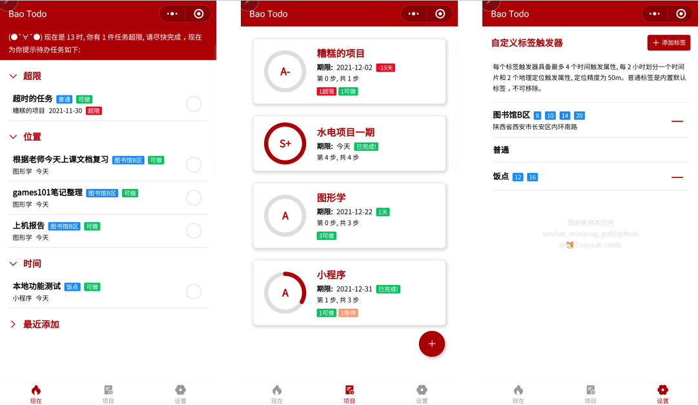
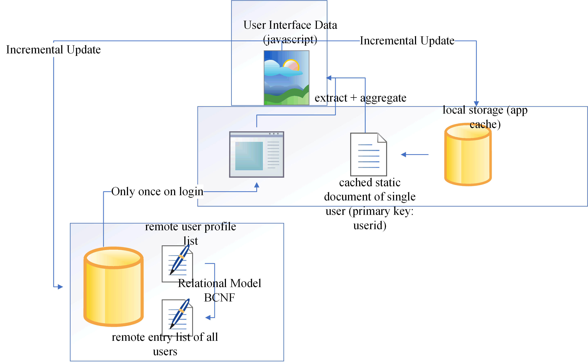

# Bao Todolist 

> 老版本的开发日志在根目录 [README.dev.md](./README.dev.md) 下

当今社会，每个人都有很多任务要处理。根据 GTD 理论，能马上完成的事情必须尽早完成，能马上开始的事情必须尽早开始，能**外包**的事情绝不自己做，一下子做不完的事情 DDL 没到之前**能不做就不做**。

互联网发展进入第三阶段后，物理世界逐渐实现全面数字化。这意味着生产力和生产关系发生了变化，个人需求和形式也必须随之改变，才能够更好地应对挑战。

传统的 GTD 应用条目繁杂，不够聚焦，缺乏**上下文**功能，而高级程序比如 OmniFocus 又只能在特定操作系统下进行使用。

根据 GTD 理论，用户时刻需要根据当前工作场景进行 [Trigger List](https://www.google.com/url?sa=t&rct=j&q=&esrc=s&source=web&cd=&cad=rja&uact=8&ved=2ahUKEwiyk7_zqvT0AhWXdHAKHfBsDpAQFnoECAIQAQ&url=https%3A%2F%2Fgettingthingsdone.com%2Fwp-content%2Fuploads%2F2014%2F10%2FMind_Sweep_Trigger_List.pdf&usg=AOvVaw0AJdqt9gZ47GT3h6XUAhrQ) 的 **Polling** 遍历，耗时费神。本小程序把低效的**轮询**改为**中断机制**。并给用户提供**标签**这一**依赖注入接口**，通过一个简化的**标签功能**根据实时生活场景（主要依赖实时定位和时间段分析）进行个性化任务推荐，聚焦当前最应该做的任务，避免重复进行选择判断。

本小程序**执行部分**根据 GTD 理论，只抽象出**项目**和**任务**两个概念，通过用户提前注入**场景**，如时间点触发，地理位置触发，生活场景触发。将**条目**根据场景分为各种不同类型的执行**促进生活场景全链路打通**，利用小程序 API 获取地理时间信息**形成抓手**，使用户生活**形成闭环**。

# 预览

# 扩展方向

由于时间关系以及个人开发小程序类目的一些限制，本来设计的一些东西没有实现。未来可以进行扩展打通。

传统的 GTD 只是针对个人业务管理，每个人的 GTD 系统不一样，很难**形成闭环**，打通**全链路聚合**，未来小程序可以通过提供**统一生态**，**精细化沟通**，减少分歧。通过小程序的包工头社区，提供一个包工头和力工的统一沟通协作平台，**重构**协同办公，使得计划到位，目标清晰，通过暴露互联网外包的**抓手**，**精准施策**，**耦合** GTD 理论，打通 GTD **全链路生态**，**赋能**大家的日常生活，让外包力工和外包包工头之间最终**形成完美的闭环**，**对齐**双方，**凝聚**共识，解决 GTD 在外包工程应用过程中的**痛点**。

未来有望打造成包工头**元宇宙**。

# 点

本次由于上次白飘的免费阿里云服务器是国内服务器，加上时间原因，1块钱买的域名又未进行需要的两个备案手续，所以采用了云开发。

本来设想使用云开发的文档数据库进行仿关系型数据库的用法，设计范式库表让数据完全云上操作，轻量级小程序。可惜由于云函数调用的延迟，外加免费只有每天 500 次数据库访问，为了省钱，最后完全基于单个文档进行数据存储，完全违反了关系型数据库的 2NF、 3NF 要求。

于是结果是一个本地应用的模式云只做了注册和数据保存等本地使用时需要严格管理权限的功能（如 openid 获取），但主要库表还是设计为通过外键标识，未来可轻松改为关系型数据库模式。

# 未能在云开发实现的存储设计

原本的存储设计是这样的，由于云开发免费次数的限制，遗憾没有完整实现。

由于频繁查询数据库会造成昂贵的费用支付效果, 以及使用过程中静态数据的重复上网会带来不必要的流量损耗, 计划通过全链路聚合, 打通壁垒, 结合小程序的 MVVM 双向绑定呈现模型, 设计了**三级反馈数据缓存模式**. 基于 GUI 应用的多处数据冗余，达成全链路聚合打通，形成闭环负反馈，避免大量数据的复制层层扩散。

用户登录一次获取, 多次使用, 通过**增量动态更新**, **缓存动态反馈冲刷** 等效果实现性能优化（图片使用老掉牙 visio 图形绘制）:

