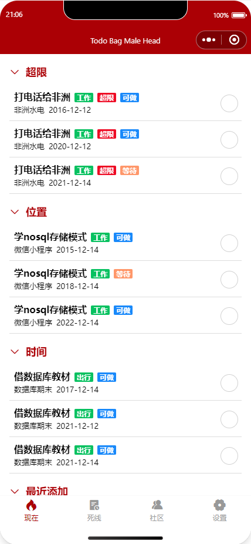
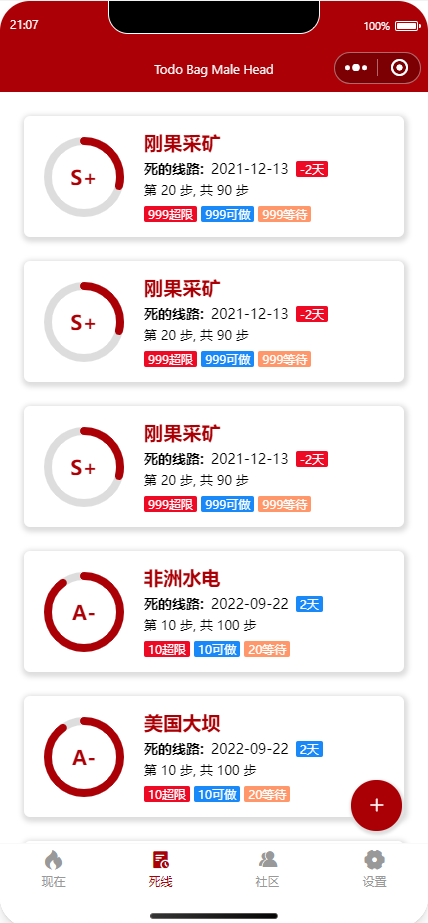

# 包工头 Todolist 小程序

当今社会，每个人都有很多任务要处理。根据 GTD 理论，能马上完成的事情必须尽早完成，能马上开始的事情必须尽早开始，能**外包**的事情绝不自己做，一下子做不完的事情 DDL 没到之前**能不做就不做**。互联网发展进入第三阶段后，物理世界逐渐实现全面数字化。这意味着生产力和生产关系发生了变化，个人需求和形式也必须随之改变，才能够更好地应对挑战。传统的 GTD 只是针对个人业务管理，每个人的 GTD 系统不一样，很难**形成闭环**，打通**全链路聚合**，这次我的小程序通过提供**统一生态**，**精细化沟通**，减少分歧。通过包工头 Todolist 小程序，提供一个包工头和牛马力工的统一沟通协作平台，**重构**协同办公，使得计划到位，目标清晰，通过暴露互联网外包的**抓手**，**精准施策**，**耦合** GTD 理论，打通 GTD **全链路生态**，**赋能**大家的日常生活，让外包力工和外包包工头之间最终**形成完美的闭环**，**对齐**双方，**凝聚**共识，解决 GTD 在外包工程应用过程中的**痛点**。

本小程序**执行部分**根据 GTD 理论，只抽象出**死线**和**条目**两个概念，通过用户提前注入**场景**，如时间点触发，地理位置触发，生活场景触发。

将**条目**根据场景分为各种不同类型的执行**促进生活场景全链路打通**，利用小程序 API 获取地理时间信息**形成抓手**，~~提供社区小组团购功能~~使用户生活**形成闭环**。

~~随着不断更新, 未来将打造成中国数一数二的包工头**元宇宙**! (~~

### 点中点：
- 简洁聚焦 UI，好看也好用，操作逻辑简化，**傻瓜**式操作，用户**没有学习成本**。
- APP 功能扩展性强，采用简化 GTD 概念，程序设计简单可扩展，未来可扩展支持**元宇宙**，打通全链路虚拟体验。
- 采用云开发文档数据库部署，轻便简单，**方便导出数据**（json 可读易解析）逃离本平台快速迁移到其他平台。
- 组件采用 Vant-weapp UI 开源组件，与自定义组件，可复用组件定制 component **前端模块化**， 支持魔改其他用途，轻便快速。
- CRUD 尽可能在云函数上一次完成，一次数据传送，用户修改更新数据时基于 MVVM 定制**三级反馈数据缓存模式**，减少延迟，提升用户体验。

### 目录：

- 小程序界面（初版）

- 库表设计

- 存储设计（三级反馈数据缓存模式）

- 概念设计

- 可能的功能

- 开发日志

---

# 小程序界面（初版）：

---
# 库表设计

但是懒得画 E-R 图了，指哪打哪，敏捷开发，快速出活。

### User Information(扩展用，以及社区信息)：
 - _id: generated by wx db
 - _openid(primary key): identify a user (basically for searching his project list)
 - _description: user name etc. preserved for future use
 - _register_date: maybe useful
 - _share_id: (not implemented yet), an inter-application user id (一个做法是通过 id 加好友，第二个是社区大厅里面用的，目前想法是加载用户列表？然后根据这个 id去调用云函数)
 - _reputation: preserved （可以用来排名）

### Todos (登录的时候 load 进来): 
 - _id: wx genreate
 - _openid(primary key): identify a user (basically for searching his project list)
 - _projects(an array), 后面可能会改用外键（即当成关系型数据库用，同时这样能够提供外包项目共享和权限控制功能），但是这样要直接合并 Todos 和 User Information 两个表。

 ### project 对象设计(包括视图和持久化)
 标记为 agg 的为聚合属性,需要根据 sub 列表内容计算更新. 
 - pid: 项目 id 不会改变（如果改用独立表，可能需要添加 ownerid 等东西）
 - title: 项目名
 - ddl: 截止日期
 - [view] countdown: 仅展示用，实时根据当前日期和 ddl 计算
 - [agg] progress: 进度缓存
 - [agg] wait：
 - [agg] outofdate:
 - [agg] cando: 
 - [agg] total:
 - [view] score: 根据当前进度，逾期等加权计算的评分(S+,A-)
 - subs: 一个子项目列表，这个可以有两种做法，一个是分开做一个表，然后用一个 foreign key 来做；一种是直接做一个 json 嵌入数组。
 - bonus: preserved key for archievement system/outsourcing, together with an archievement store

### subs 内容（entry/item）

前面说了这个可以有两种做法，一个是分开做一个表，然后用一个 foreign key 来做；一种是直接做一个 json 嵌入数组。考虑到如果要添加根据地理位置来展示 now 的话，一个做法是直接用云函数去查满足 tag 的 subs。

暂且当云开发的查询是有索引优化的话，用一个独立的表每次都查询一次也不是不能接受。如果每次登录就全部拿到本地，要维护一份除了给 UI 用的数据之外维护这个也挺麻烦的。

而且本来根据分层的思路，在网络应用应用层搞 CRUD 本来就不对劲，所以还是用云开发来做查询吧。

所以决定是 subs 列表里面存的是一个 sub 的外键。
 - _id: generated by wx
 - _iid: primary key  
 - _title: 
 - _ddl: 
 - _triggerdate: 这个是为了用来标记 waiting 时间的，要特定日期触发
 - _tag: preserved for future usages
 - _scene: 决定什么时候在 now 里面显示提醒
 - _prereq: the item must happen before this
 - _outbag: 外包（保留字，勿吐槽拼写）
 - _done: done
---

因为外包部分很麻烦，所以外包部分等待版本更新。

# 存储设计

由于频繁查询数据库会造成昂贵的费用支付效果, 以及使用过程中静态数据的重复上网会带来不必要的流量损耗, 我通过全链路聚合, 打通壁垒, 结合小程序的 MVVM 双向绑定呈现模型, 设计了**三级反馈数据缓存模式**. 基于 GUI 应用的多处数据冗余，达成全链路聚合打通，形成闭环负反馈，避免大量数据的复制层层扩散。

用户登录一次获取, 多次使用, 通过**增量动态更新**, **缓存动态反馈冲刷** 等效果实现性能优化（图片使用老掉牙 visio 图形绘制）:

---

# 初版概念设计

### Now :
根据 GTD 的理论，这里必须有一个 Inbox 收件箱处理各种事情的，为了专注外包项目，这里必须从项目来规划。
现在这个 Now 是 GTD 理论中的根据 Trigger list 来触发的当前子任务。

### Deadline：
这个是项目的起点和重点。全程进度跟踪。DDL 警告。

### Community：
社区页面，完成外包指派。外包之前必须生成完整的外包项目。
社区首页是个人 profile，每个人在社区都有两个职责：
    - 包工头
        - 牛马力工
### 包工头页面：

 - 看到所有的 Bag Male head 发布的信息
 - 可以发布新的Bag Male 任务
单个外包项目详情页面：
 - 看到包公完成进度，可以加钱和扣钱
 - 不能改合同
 牛马力工页面：
  - 首先是包公大厅，领取最新包公
  - 然后是完成包公任务。

---

# 有待 (不会) 实现:
- [ ] 添加社区页面和牛马力工页面
- [ ] 提供社交功能, 首先是用户列表获取, 好友添加
  - [ ] Ranking 功能
  - [ ] 外包单条目功能(一种想法是让 subscriber 订阅一个 project, 然后只有权限修改, 类似 fork 和 pull request)
  - [ ] 社区类似 github 的 watch 功能, 同样是 subsribe 一个 project with view only authority.
  - [ ] ddl 页面里左边评分的详情 pop up
  - [ ] reputation 商城功能, 外包元宇宙货币, 积分功能
  - [ ] 升级到元宇宙, 比如完成任务之后可以得到艺术卡片, 然后还有好友监督功能 (结合上面说的 watch 功能做), 对赌协议功能 (通过外包货币实现)
- [ ] Focus 小插件, 可以添加现场用 canvas + 动画控制来定时种分形树, 番茄钟, Forest 类似的功能, 或者激进地种一个小宠物, 中途退出小程序就把小宠物杀死, 加上血腥特效拉满节目效果.
- [ ] 启动时 (应该是 onShow 的时候) 获取地理位置, 然后根据提前设置好的 tag 来做 page Now 的 filtering.
- [ ] 设置页面
  - [ ] 支持禁止 now 页面显示超限
  - [ ] 控制各个出现列表地方的排序定制
  - [ ] 颜色控制, 但是不需要夜间模式因为 project 不会在夜间推进(额, 其实难讲), 目前的 main 颜色设置的是血红, 因为 ddl 总是伴随着腥风血雨. 颜色这个涉及到 class 用动态绑定切换, 得提前写好一些颜色. 如果能结 合 reputation 商城提供背景功能.
  - [ ] 控制各个出现列表页面是否显示已完成项目
  - [ ] 支持导出 ics 到 calendar application (distracted)
  - [ ] 导出功能, 这个实际因为设计上是通过云开发搞的, 不过本身云开发用的不过是 document database 而已, 可以导出 js 给用户, 之后可以迁移到 uni-app , 可以改造成 web + 小程序 + Android hybrid app + ios native + ... 全平台.

---

# 开发日志(时间线为从上往下)

- **日志1**：因为设计库表太麻烦了，暂时重新简化一下概念，每个项目的子条目状态只划分为等待事件和可做事件。每个事件可以设置 ddl 或者不设置。
每个事件可以设置等待，等待既可以是外包事件，也可以是特定事件、条件触发事件，不属于能马上完成的。

- **日志2**：之前都是画 UI 切图乱写，指哪打哪，敏捷但不靠谱，避免多次复盘重复影响体验，我决定大局意识格局打开顶层设计。
复习了关系型数据库系统概论，所以先重新设计好数据关系先。由于云开发数据库是个文档数据库，一个id一个 json 文件的样子？对于查询肯定有别的优化。
一开始按关系型数据库想，结果这样搞到一次登入要分很多次请求。和做本地 app 用 sqlite 是不一样的。
网络程序就算后端要用 sql，本来进行数据交换的时候也要后端去序列化做 json 出来。所以直接对象数据 json 直接存就好了。
由于尽量是一次登入就把所有数据 load 进来，但是这样也还是不想用嵌套 json 数组，json 数组的问题在没有办法单条快速更新？
但是对于 now 页面要做的是获取某些条目，然后根据 tag 和 due date 来做 filtering 之后展示出来，这个如果不在数据库里面做好的话就要遍历查询了。

- **日志3**： 又做了一天 uiboy，
vant-weapp 的 circle 又有 bug 
（我不是乱说的，因为不改 vant 的 wxml 是没办法解决的），
又浪费了很多时间。
本来在 issue 区看到一种做法是用 wx 的 temp file 来和 canvas 
做一个 double buffer，
但是因为我有很多个 circle，这样管理反而麻烦。
canvas必须顶层而且会飘逸的解决不了了，
对于紧跟着他的 view 错位问题是因为他渲染的时候有延迟，
这是 circle 的 canvas 的父 view 没有指定 width 和 height 结果会排列错位。
结论是，遇事不决先研究一下源码（额）。
**第二个**是设计这个 gtd 里面的概念太复杂了，现在尽量简化概念了，
接下来要怎么处理数据然后给剪裁到 Now 页面和 DDL 页面的思路还没有很好的想法。
**还有一件事**，今天继续熟悉了条件编译和数据绑定，之前没有仔细学习不知道这个
css 的绑定和 attribute 都能用 `{{}}` 语法绑定，这下重构一下之前写的垃圾代码。
虽然还有很多命名不规范的问题，小程序的 IDE 重命名功能也不太好用，有时间一定修改一下不然
就滚雪球了。对于 row col 我发现熟悉 flex 之后也不是那么需要了，可能以前写 windows 程序
用 grid 用习惯了，但是微信和 vant 的 row col 都不是 grid ，css 3 的 grid 微信又没有
完全支持，还是尽量用 flex 布局吧。
**顺便mark一个东西**， 之前跟 freecodecamp 学的前端全套，
结果是学到的用 `:root{}` 定义全局变量在微信里面用不了，原来微信自己又搞了一个 `page{}` 的命名空间.... 早知道用通用的 vue 框架了。现在脑子一团浆糊全混一起了。
